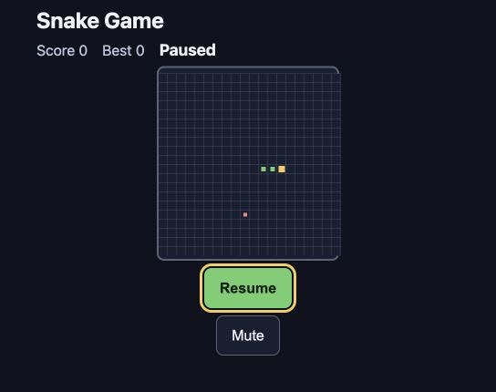
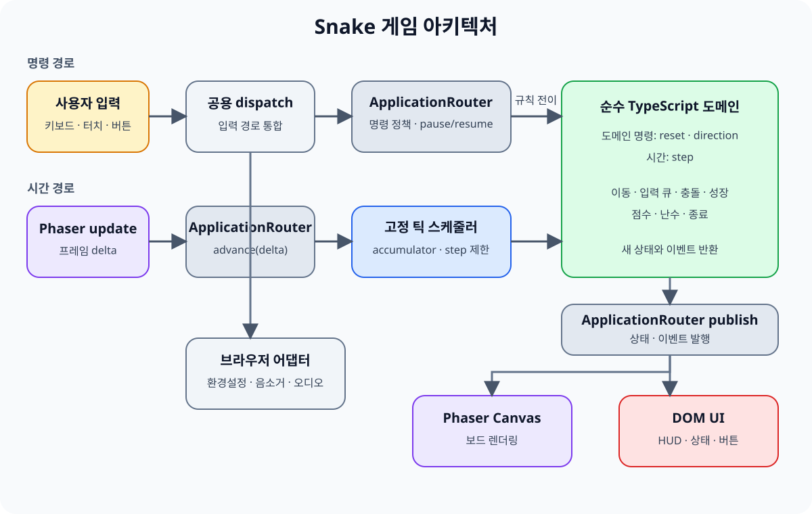

# 세 AI와 함께 만든 브라우저 Snake 게임 개발기: 규칙, 아키텍처, 그리고 QA

[게임 플레이](https://dragoncowkarma.github.io/snake-game/) · [GitHub 저장소](https://github.com/dragoncowkarma/snake-game) · [배포 소스 정보](https://dragoncowkarma.github.io/snake-game/release.json)

## 들어가며

웹 브라우저에서 실행되는 Snake 게임을 TypeScript와 Phaser로 구현했다. 겉보기에는 단순한 고전 게임이지만, 빠른 연속 입력 처리, 렌더링 프레임과 분리된 이동 스케줄러, 상태 전환(일시정지/재개), 그리고 모바일 레이아웃과 접근성까지 명시적인 규칙으로 관리했다.

제품 기획부터 구현, 통합, QA에 이르는 전 과정은 세 AI 에이전트(Claude, Codex, Antigravity)가 분담했고, 관문 승인과 병합은 사람이 맡았다. 이 문서에서는 역할을 어떻게 나눴는지, 어떤 아키텍처와 구현 규칙을 적용했는지, 그리고 QA 과정에서 발견하고 해결한 문제들을 공유한다.

공개 사이트에 프로덕션 빌드를 배포하고 실사이트에서 핵심 흐름까지 확인했다. 다만 릴리스 후보 판정은 아직 열려 있다. 크로스 브라우저 회귀 매트릭스는 Chromium 구간만 채워졌고, WebKit과 실기기 검증, 사람 플레이테스트가 남아 있다.

## 무엇을 만들었나

| 구분 | 내용 |
|---|---|
| 제품 | 브라우저에서 실행되는 단일 플레이어 Snake 게임 |
| 입력 | 이동은 방향키·WASD와 화면 방향 버튼, 그 밖에 `P`·`Escape`(일시정지/재개)와 `M`(음소거) 단축키 |
| 상태 | 메뉴, 준비, 플레이, 일시정지, 게임 오버, 승리 |
| 기능 | 난이도, 점수와 최고 점수, 음소거, 재시작, 메뉴 복귀 |
| 렌더링 | 게임 보드는 Canvas, HUD와 모든 조작 버튼은 DOM |
| 품질 목표 | 결정론적 규칙, 키보드 접근성, 반응형 UI, 장애 시 계속 플레이 |
| 배포 | 저장소 하위 경로를 사용하는 정적 [GitHub Pages](https://docs.github.com/pages) |

기술 스택은 [TypeScript](https://www.typescriptlang.org/), [Phaser](https://phaser.io/), [Vite](https://vite.dev/), [Vitest](https://vitest.dev/), [Playwright](https://playwright.dev/)로 구성했다. MVP 단계에 집중하기 위해 외부 아트 자산, 원격 폰트, 분석 SDK, 런타임 네트워크 API는 제외했다. 또한 로컬 저장소, 오디오, 화면 효과 등 환경에 의존적인 기능이 실패하더라도 게임의 핵심 루프는 멈추지 않도록 설계했다.

## AI 팀의 역할 분담

각 에이전트는 코드 생성기가 아니라 소프트웨어 엔지니어링의 한 역할을 맡았다.

| AI | 주요 역할 | 크로스 체크 관점 |
|---|---|---|
| Claude | 제품 명세, UI/UX, 접근성, UI 문구, 사용자 문서 작성 | Antigravity가 수행한 시각 및 접근성 QA 검토 |
| Codex | 도메인 모델 설계, 게임 오케스트레이션, 어댑터, 빌드/CI 구축 및 통합 | Claude가 작성한 제품 계약과 실제 통합 결과 대조 |
| Antigravity | 테스트 시나리오 설계, 브라우저/접근성 QA, 회귀 테스트 증거 수집 | Codex가 설계한 테스트 인프라 및 배포 증거 검증 |

판정과 병합은 사람이 했다. 관문마다 사람이 증거를 확인하고 승인해야 다음 단계가 열렸고, 원격 저장소 푸시도 사람의 몫이었다. 에이전트끼리 판단이 갈릴 때 결론을 내리는 지점 역시 여기였다.

작업은 **계약 기반(Contract-driven)**으로 진행했다:
1. 작업 전 공용 타입과 불변 규칙을 문서로 고정했다.
2. 각 작업은 허용/금지 파일, 수용 기준, 검증 명령을 사전에 선언하고 시작했다.
3. 작업 완료 시 종료 코드와 구조화된 Handoff 문서를 남겼다.
4. 가능하면 다른 에이전트가 독립적으로 교차 검토(Cross-review)를 수행했다.

## 구현 전에 정한 규칙

게임 루프와 입력 처리는 예외 상황을 방지하기 위해 구현 전부터 명확한 기준을 세웠다.

| 핵심 주제 | 고정한 규칙 |
|---|---|
| 게임 시작 | 준비 상태에서 게임을 시작시키는 것은 방향 입력이다. 초기 방향의 정반대인 `왼쪽`은 거부하고 `오른쪽`·`위`·`아래` 중 하나로 시작한다. `Enter`와 `Space`는 게임 키로 매핑하지 않는다(포커스된 버튼의 브라우저 기본 활성화는 별개다). |
| 입력 큐 | 짧은 시간에 입력된 최대 2개의 방향 전환을 큐에 저장하며, 게임의 1 이동 틱(Tick)마다 하나씩만 소비한다. |
| 역방향 판단 | 현재 뱀이 바라보는 방향뿐만 아니라, **마지막으로 승인된 예약 방향**까지 고려하여 정반대 방향 입력을 차단한다. |
| 고정 틱 | 물리 이동은 화면 렌더링 FPS와 독립적으로 동작한다. 프레임 delta는 250ms에서 자르고 한 프레임에 최대 3 Step까지만 처리해, 프레임이 밀려도 뱀이 순간이동하지 않게 한다. |
| 가속/감속 | 뱀이 먹이를 먹어 속도가 변할 경우, 캡처된 기존 Tick 시간을 차감한 후 **다음 Step부터** 새로운 속도가 적용된다. |
| 일시정지 | 방향 상태는 유지하되, 일시정지 진입 시 입력 큐와 시간 누산기(Accumulator)를 초기화한다. 브라우저 Resize 시에는 자동으로 일시정지되지 않는다. |
| 복구 가능성 | 로컬 스토리지나 Web Audio API가 브라우저 정책으로 인해 거부되더라도, 게임 루프 자체는 중단되지 않도록 Fallback을 마련했다. |

위 규칙들은 단순한 기획서에 머물지 않고, [공용 계약](https://github.com/dragoncowkarma/snake-game/blob/main/docs/coordination/CONTRACTS.md)과 [QA 계획](https://github.com/dragoncowkarma/snake-game/blob/main/docs/coordination/QA_PLAN.md)에 상태 머신 타입과 테스트 Fixture 형태로 기록되어 자동화 테스트의 기준이 되었다.

## 아키텍처: 순수 도메인의 분리

의존성의 중심에는 Phaser나 DOM이 아닌, **순수 TypeScript로 작성된 도메인 모델**이 존재한다.

### 1. 렌더링과 독립적인 순수 도메인
핵심 로직([snake-simulation.ts](https://github.com/dragoncowkarma/snake-game/blob/main/src/domain/snake-simulation.ts))은 현재 상태, 사용자 명령, 주입된 난수를 입력받아 새로운 상태를 반환한다. Phaser 객체나 DOM의 존재를 전혀 알지 못하므로, 브라우저가 없는 Node 환경에서도 결정론적으로 규칙을 테스트할 수 있다.

### 2. 고정 틱 스케줄러 (Fixed-step Scheduler)
렌더 프레임 사이의 시간 차이(Delta)를 누산기(Accumulator)에 모은 뒤, 목표한 Tick 시간이 충족될 때만 도메인 Step을 갱신한다. ([fixed-step-scheduler.ts](https://github.com/dragoncowkarma/snake-game/blob/main/src/game/fixed-step-scheduler.ts)) 이를 통해 주사율(60Hz, 144Hz 등)이 다른 모니터에서도 뱀의 이동 속도가 동일하게 유지된다.

### 3. Canvas와 DOM의 하이브리드 구성
Phaser Canvas는 보드, 뱀, 먹이, 충돌 효과 등 시각적 렌더링만 담당한다. 반면 점수판, 메뉴, 일시정지 창, 화면 방향 버튼 등은 **순수 HTML DOM**으로 구현했다. 이 분리 덕분에 키보드 포커스 제어, 스크린 리더용 `aria-pressed`, 시맨틱 태그 등 웹 접근성을 훨씬 자연스럽게 달성할 수 있었다.

## 단계별 개발 과정

1. **규칙과 경계 설정**: 제품의 상태 전이, 이벤트 Payload, 배포 경로를 사전에 확정하고 엣지 케이스를 테스트 수용 기준에 반영했다.
2. **기술 요소 Spike 검증**: Phaser와 DOM 오버레이의 결합, 모바일 입력 처리, GitHub Pages 하위 경로(`/snake-game/`)에서의 애셋 로딩을 최소 단위로 검증했다.
3. **순수 코어 구축**: 정적 검사 및 빌드 환경을 세팅한 후, 렌더러 없이 이동/충돌/아이템 생성이 동작하는 도메인 모델을 완성했다.
4. **수직 슬라이스 연결**: 메뉴 진입부터 보드 이동, 충돌 후 재시작까지 이어지는 **하나의 완전한 사용자 흐름**을 우선적으로 연결했다.
5. **생명주기와 예외 처리 보강**: 브라우저 Resize, 포커스 이동, 로컬 스토리지 권한 거부, 오디오 재생 실패 등 다양한 장애 상황에서의 회복력을 추가했다.
6. **QA 및 배포**: 코드를 작성하지 않은 제3자(AI)의 관점에서 E2E 테스트를 수행하고, 지정된 커밋 해시를 기반으로 자동화된 릴리스 워크플로를 실행했다.

## 리뷰와 QA에서 고친 문제들

개발 과정에서 단위 테스트는 통과했지만 실제 환경에서 발생한 문제들이 있었다.

### 1. `0 × 0` 픽셀로 찌그러진 보드
메뉴 화면이 떠 있는 동안 보드(Canvas) 컨테이너는 CSS로 숨겨져(`display: none`) 있었다. 이 상태에서 Phaser 인스턴스를 초기화하자 브라우저가 Canvas 크기를 0으로 계산했고, Start를 눌러 준비 화면으로 넘어가도 보드는 빈 사각형으로만 보였다.

첫 수정은 보드가 드러나는 전환 시점에 크기를 다시 계산(`scale.refresh()`)하는 방식이었지만, 독립 리뷰에서 canvas가 여전히 `0px`로 측정되어 기각됐다. `hidden`을 해제한 같은 동기 콜백 안에서 크기를 재는 한 결과는 달라지지 않았기 때문이다.

**해결**: 나중에 고치는 대신 처음부터 옳게 만들도록 바꿨다. 메뉴를 벗어나는 순간을 감지해 한 tick 뒤에야 Phaser 인스턴스를 생성하므로, 레이아웃이 확정된 보드를 측정한다.

### 2. 음소거는 됐는데 버튼 상태가 남아 있었다
키보드의 `M` 키를 누르면 게임 소리는 정상적으로 음소거되었으나, 화면의 DOM 버튼 텍스트와 `aria-pressed` 속성은 변하지 않았다. 키보드 이벤트와 클릭 이벤트의 처리 경로가 갈라져 있었기 때문이다.

**해결**: 모든 입력(키보드, 터치, 클릭)을 단일 `dispatch` 경로로 통합하고, 명령의 실행 결과가 UI 메타 상태로 다시 흘러가도록 데이터 플로우를 단방향으로 통일했다.

### 3. Firefox에서 결정적으로 실패한 연속 입력 테스트
Playwright E2E 매트릭스를 넓히자 Firefox에서 빠른 연속 키 입력 테스트가 재실행마다 3/3으로 실패했다. 간헐적 실패가 아니라 항상 같은 결과였다. 오히려 Chromium에서는 콜드 스타트 직후에만 드물게 같은 증상이 나타났다.

원인은 게임 로직이 아니라 자동화 계층이었다. Firefox의 키보드 IPC 왕복 지연이 Chromium보다 체계적으로 커서, 8번 연속 키 입력 사이의 실제 경과 시간이 게임 틱(160ms)을 넘겼다. 그러면 여분의 틱이 끼어들어 뱀이 벽에 부딪히고, 이후 입력은 더 이상 게임 입력으로 처리되지 않는다.

**해결**: 제품 코드를 우회하는 대신, 테스트가 디스패치된 명령 기록과 화면 상태 변화를 `expect.poll`로 여유 있게 기다리도록 고쳤다. 필요한 선행 입력도 명시해 첫 키가 현재 진행 방향과 수직이 되게 했다. 이 두 테스트는 Firefox 1366×768에서 3/3 통과한다. 다만 CI가 상시 실행하는 엔진은 여전히 Chromium이고, Firefox 전체 뷰포트 매트릭스 재검증은 남은 과제다.

## 검증 파이프라인

릴리스 검증 스크립트(`npm run verify`)는 다음 순서를 모두 통과해야 한다:
`format` → `lint` → `typecheck` → `unit` → `coverage` → `build` → `browser E2E`

[품질 CI](https://github.com/dragoncowkarma/snake-game/blob/main/.github/workflows/quality.yml)는 이 가운데 정적 검사와 139개의 단위 테스트, 18개의 Chromium E2E 테스트를 실행하고, 커버리지 임계값 검사는 릴리스 워크플로의 `verify` 단계에서 수행된다. 커버리지 계측 대상은 순수 도메인(`src/domain`)이며 **Statement 97.59%, Branch 96.61%**를 기록했다. 통과 기준선은 네 지표 모두 90%인데, 개별 파일이 아니라 도메인 전체 합산에 적용된다.

테스트가 초록불인 것만으로는 충분하지 않다고 보고, 코드를 고의로 망가뜨렸을 때 정말 빨간불이 되는지도 확인했다(음성 통제, Negative Control). 일곱 가지 중 네 가지를 옮기면 이렇다.

| 코드에 주입한 고의적 결함 | 확실하게 실패해 준 검증 항목 |
|---|---|
| 보드 오른쪽 벽 경계 비교를 1칸 늦춤 | 벽 충돌 Snapshot 테스트 및 종료 이벤트 검증 |
| 먹이 생성 시 뱀의 몸통 필터링 제거 | 먹이 겹침 검증 및 난수 호출 범위 검증 |
| 두 번째 큐 입력 시 현재 방향만 비교 | 예약 방향까지 고려하는 연속 입력 규칙 검증 |
| 물리 틱 시간을 다음 Step이 아닌 현재 차감에 사용 | 시간 누산기(Accumulator)의 정확성 검증 |

## 배포와 향후 과제

[GitHub Pages 릴리스 워크플로](https://github.com/dragoncowkarma/snake-game/blob/main/.github/workflows/pages-release.yml)로 고정된 커밋의 프로덕션 빌드를 공개 사이트에 배포했다. 공개 URL에 직접 접속하는 Playwright 스모크로 메뉴 → 준비 → 플레이 → 일시정지 → 재개 → 게임 오버 → 재시작 흐름과 320px 폭 방향 버튼을 실측했고, 콘솔 에러와 404 리소스는 0건이었다.

배포와 실사이트 동작은 이렇게 확인했지만, 이것을 릴리스 수락으로 보지는 않았다. 크로스 브라우저 회귀 매트릭스가 Chromium 구간만 채워진 상태이고, 그 판정이 끝나지 않았기 때문이다.

앞으로 남은 과제는 다음과 같다:
- 업로드될 최종 정적 파일 아티팩트를 대상으로 배포 전 한 번 더 E2E를 실행하도록 CI 파이프라인 강화
- 공개 URL 스모크를 1회성 스크립트가 아니라 저장소에 커밋된 테스트 자산으로 승격
- Firefox 전체 뷰포트 매트릭스 재검증, WebKit 및 실제 iOS/Android 모바일 기기에서의 입력 반응성 검증
- VoiceOver/TalkBack 스크린 리더 환경에서의 실사용 테스트
- 실제 사용자를 대상으로 한 플레이 감각(속도감, 조작감) 피드백 수집
